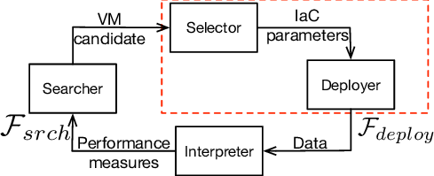

# 🧩 Abstract VM

<p align="center">
    <a href="" target="_blank">
        
    </a>
</p>

## Overview
Abstract VM is a C++ project that simulates a stack-based virtual machine capable of executing instructions defined in a custom assembly-like language. This project allows you to perform various operations such as arithmetic calculations, data manipulation, and more.

## Features
- **Stack Operations:** Push and pop data from the stack.
- **Arithmetic Operations:** Perform operations like addition, multiplication, and more.
- **Type Handling:** Support for various data types, including `int32`, `float`, and `double`.
- **Assertions:** Validate stack values with assertions.
- **Exit Command:** Gracefully terminate the program execution.

## Example
The following example illustrates how to use the virtual machine:

```assembly
; -------------
; example.avm -
; -------------

push int32(42)
push int32(33)

add

push float(44.55)

mul

push double(42.42)
push int32(42)

dump

pop

assert double(42.42)

exit
```

### Syntax and Instructions

- **Comments:** Begin with a `;` and end at the newline. Comments can appear at the start of a line or after an instruction.

- **Instructions:**
  - **`push v`**: Pushes the value `v` onto the top of the stack. The value `v` can be one of the following formats:
    - `int8(n)`: Creates an 8-bit integer with value `n`.
    - `int16(n)`: Creates a 16-bit integer with value `n`.
    - `int32(n)`: Creates a 32-bit integer with value `n`.
    - `float(z)`: Creates a float with value `z`.
    - `double(z)`: Creates a double with value `z`.

  - **`pop`**: Removes the value from the top of the stack. If the stack is empty, the program execution stops with an error.

  - **`dump`**: Displays each value in the stack from the most recent to the oldest without altering the stack. Each value is separated by a newline.

  - **`assert v`**: Asserts that the value at the top of the stack matches the value passed as a parameter. If it does not, the program execution stops with an error. The value `v` must be in the same format as those used in the `push` instruction.

  - **`add`**: Removes the top two values from the stack, adds them, and pushes the result back onto the stack. If there are fewer than two values on the stack, the program execution stops with an error.

  - **`sub`**: Removes the top two values from the stack, subtracts the second from the first, and pushes the result back onto the stack. If there are fewer than two values on the stack, the program execution stops with an error.

  - **`mul`**: Removes the top two values from the stack, multiplies them, and pushes the result back onto the stack. If there are fewer than two values on the stack, the program execution stops with an error.

  - **`div`**: Removes the top two values from the stack, divides the second by the first, and pushes the result back onto the stack. If there are fewer than two values on the stack or if the first value is zero, the program execution stops with an error.

  - **`mod`**: Removes the top two values from the stack, calculates the modulus of the second value by the first, and pushes the result back onto the stack. If there are fewer than two values on the stack or if the first value is zero, the program execution stops with an error.

  - **`exit`**: Terminates the program execution.

## Prerequisites

Before you begin, ensure you have met the following requirements:

- A C++ compiler (e.g., `g++`) installed on your machine.
- Basic understanding of C++ programming and assembly-like languages.
- Familiarity with using terminal or command-line interfaces.

## Getting Started

To get a copy of the Abstract VM project up and running on your local machine, follow these steps:

### 1. Clone the Repository
First, clone the repository to your local machine:
```bash
git clone git@github.com:Abdelmathin/abstract_vm.git
```
### 2. Navigate to the Project Directory

Change into the project directory:

```bash
cd abstract_vm
```

### 3. Compile the Project

Use the provided Makefile to compile the project:

```bash
make
```

### 4. Running the Virtual Machine

To run the virtual machine with an example file, use the following command:

```bash
./abstract_vm example.avm
```

### 5. Create Your Own Example

You can create your own .avm file using the specified syntax and run it to see how the virtual machine processes your instructions.
